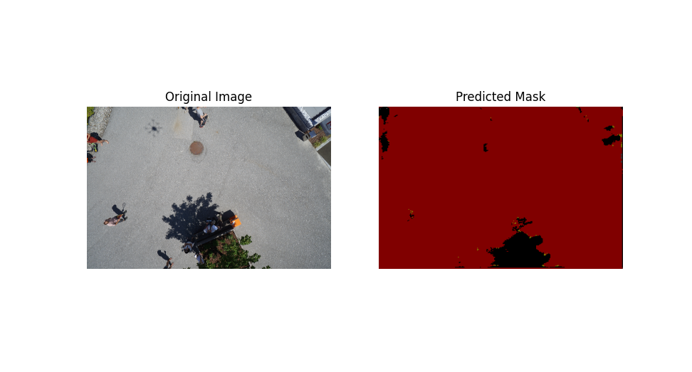

# Terrain Semantic Segmentation

PyTorch와 U-Net(EfficientNet-B0 Encoder)을 활용하여 드론(항공) 이미지를 Semantic Segmentation으로 분할하는 프로젝트

입력된 항공 이미지를 여러 클래스의 지형으로 분류하여 픽셀 단위의 예측 마스크를 생성

---

## 주요 기능

- 드론 이미지 Semantic Segmentation
- U-Net(EfficientNet-B0 Encoder) 모델 학습
- 학습 모델 저장 및 불러오기
- 예측 결과 시각화
- PyTorch 기반 딥러닝 학습

---

## 모델 구성

- Architecture : U-Net
- Encoder : EfficientNet-B0
- Framework : PyTorch
- Loss : CrossEntropyLoss
- Optimizer : Adam

---

## 실행 화면

<p align="center">
  
</p>

---

## 학습 결과

- 항공 이미지를 입력받아 픽셀 단위의 지형 분할 수행
- 학습된 모델(`.pth`)을 활용한 추론 지원
- 원본 이미지와 예측 마스크를 함께 시각화하여 결과 확인

---

## 프로젝트 구조

```text
terrain_project/
├── data/
│   ├── images/
│   └── masks/
├── src/
│   ├── dataset.py
│   ├── image.py
│   ├── model.py
│   ├── train.py
│   ├── test.py
│   └── utils.py
```

---

## 실행 방법

### 1. 저장소 클론

```bash
git clone https://github.com/사용자이름/terrain_project.git
cd terrain_project
```

### 2. 라이브러리 설치

```bash
pip install -r requirements.txt
```

### 3. 모델 학습

```bash
python src/train.py
```

### 4. 추론(Test)

```bash
python src/test.py
```

---

## 개발 환경

- Python
- PyTorch
- segmentation-models-pytorch
- torchvision
- Pillow
- NumPy
- Matplotlib

---

## 스택

### Language

- Python

### Deep Learning

- PyTorch
- segmentation-models-pytorch

### Image Processing

- Pillow
- NumPy
- torchvision

### Visualization

- Matplotlib
